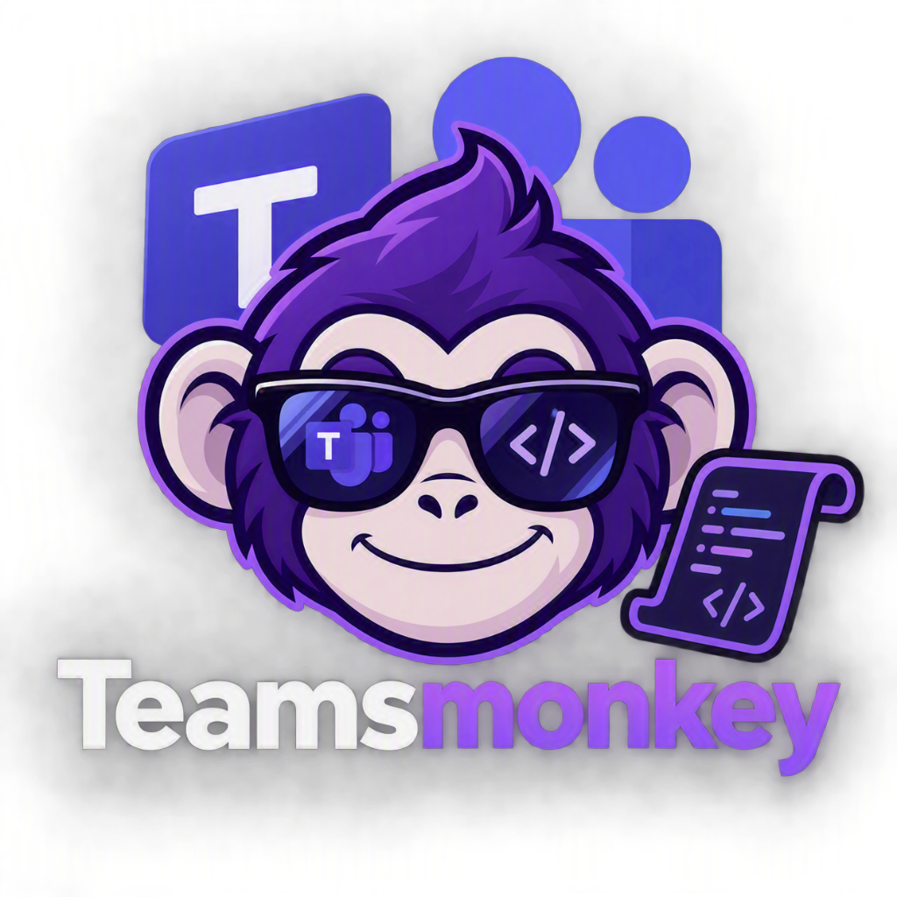
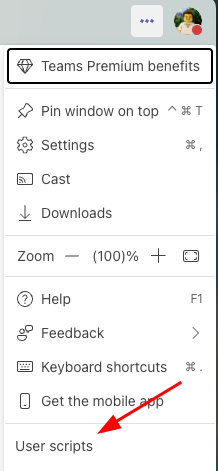
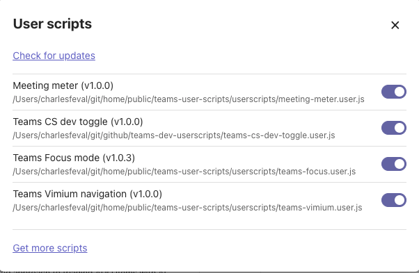
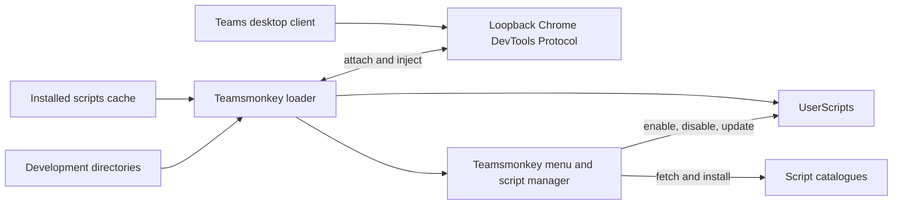
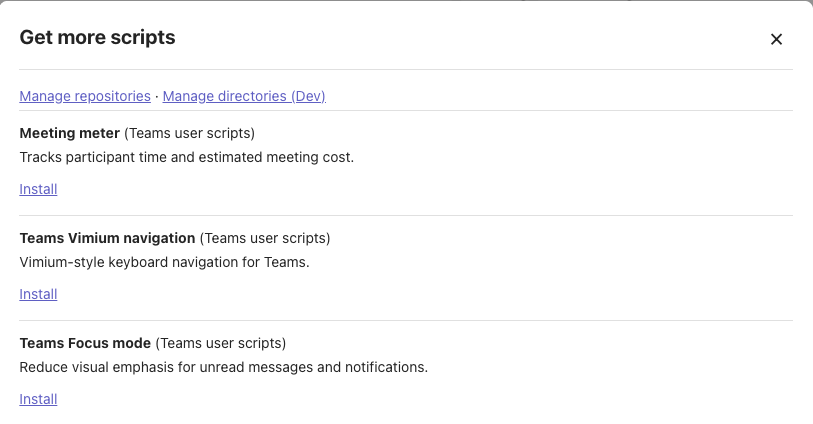

# Teamsmonkey



Teamsmonkey is a sidecar UserScript loader for the Microsoft Teams desktop
client. When installed on your system, it adds a menu in Teams that allows
you to load userscripts. Userscripts are small scripts allowing you to
customize and enhance the functionality of Teams.



Teamsmonkey is risk-free: it modifies temporarily your Teams client temporarily,
all modifications are removed as soon as you stop it. It doesn't modify your
files, doesn't touch your data, doesn't add any telemetry.



## How it works



The bundled **User scripts** manager lets you enable and disable installed
scripts, browse the default
[teams-user-scripts](https://github.com/cfe84/teams-user-scripts) catalogue,
install scripts, manage additional compatible repositories, and check for
updates. Updates are checked when Teams loads and hourly while it is running.



## Run the loader

Go 1.23 or newer is required to build the standalone loader:

```bash
make build
./teamsmonkey --port 9223
```

The loader also accepts `--scripts`, `--port`, `--host`, `--target`, and
`--poll-ms`. The `--scripts` option takes precedence over
`TEAMSMONKEY_SCRIPT_PATH`.

## Service installation

On macOS, this installs launch agents. On Windows, it installs a per-user
Task Scheduler task that starts Teamsmonkey when you sign in:

```bash
make install
```

The service install checks that Teams is already exposing CDP or that
`WEBVIEW2_ADDITIONAL_BROWSER_ARGUMENTS` is configured for the user. If it is
not configured, set it before installing.

On macOS:

```bash
launchctl setenv WEBVIEW2_ADDITIONAL_BROWSER_ARGUMENTS --remote-debugging-port=9223
```

On Windows PowerShell:

```powershell
[Environment]::SetEnvironmentVariable(
  'WEBVIEW2_ADDITIONAL_BROWSER_ARGUMENTS',
  '--remote-debugging-port=9223',
  'User'
)
```

Fully quit and reopen Teams after changing the environment, then run
`make install` again. To remove the service:

```bash
make uninstall
```

On Windows, uninstall removes only the Teamsmonkey scheduled task. It does
not remove `WEBVIEW2_ADDITIONAL_BROWSER_ARGUMENTS`, because that setting may
be used by other WebView2 applications.

The loader must be connected to a loopback-only CDP endpoint. CDP has no
authentication, so any local process that can reach the endpoint can inspect
and control signed-in Teams content.

The macOS launch agents are named `com.teamsmonkey.env` and
`com.teamsmonkey.loader`. The Windows scheduled task is named `Teamsmonkey`.
Service management is implemented by the Go binary, so Node.js is not
required.

## Development and technical details

Teamsmonkey is a local service that attaches to the local Chrome DevTools Protocol 
endpoint exposed by the embedded web runtime, without modifying the signed
Teams application.

Installed scripts are loaded from:

- macOS and Linux: `~/.config/teamsmonkey/scripts`
- Windows: `%APPDATA%\teamsmonkey\scripts`

Set `TEAMSMONKEY_SCRIPT_PATH` to use a different directory. The bundled manager
is always available and does not need to be copied into the scripts directory.

For local development, use **Manage directories (Dev)** in the User scripts
menu to add or remove script directories. Those directories are persisted in
the Teamsmonkey configuration and scanned at loader startup and whenever their
contents change. Scripts in the cache directory take precedence over
development-directory scripts with the same filename.

Private GitHub script repositories are supported through the standalone loader.
If GitHub CLI is installed and authenticated, Teamsmonkey automatically uses
`gh auth token` without copying the token into Teams. You can also provide a
token explicitly with `TEAMSMONKEY_GITHUB_TOKEN`; `TEAMSMONKEY_GH_PATH` can be
used when `gh` is installed outside the standard locations. Tokens are used
only for requests to `raw.githubusercontent.com` and are never exposed to the
page or persisted by Teamsmonkey.